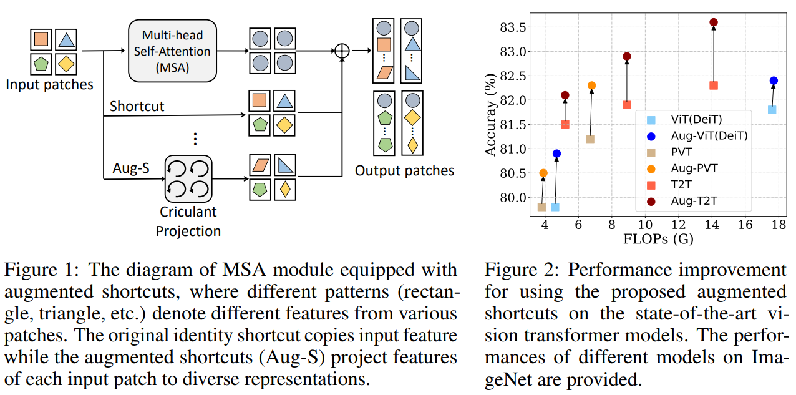
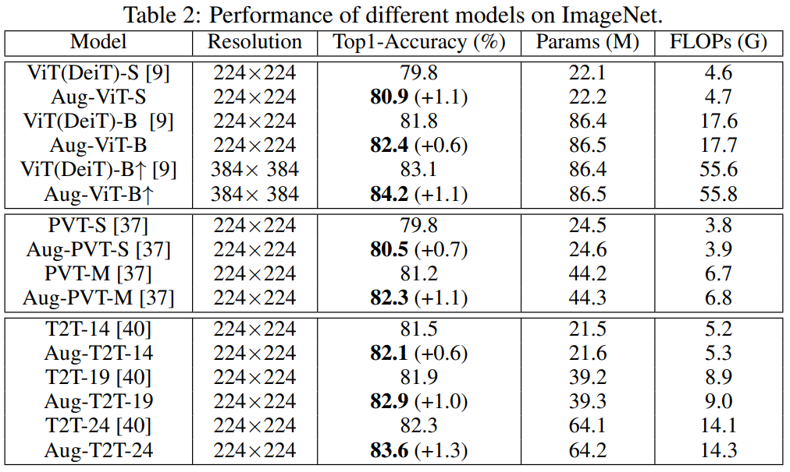

# Augmented Shortcuts for Vision Transformers

Code for our NeurIPS 2021 paper, [Augmented Shortcuts for Vision Transformers](https://proceedings.neurips.cc/paper/2021/file/818f4654ed39a1c147d1e51a00ffb4cb-Paper.pdf). Transformer models have achieved great progress on computer vision tasks recently. The rapid development of vision transformers is mainly contributed by their high representation ability for extracting informative features from input images. However, the mainstream transformer models are designed with deep architectures, and the feature diversity will be continuously reduced as the depth increases, i.e., feature collapse. In this paper, we theoretically analyze the feature collapse phenomenon and study the relationship between shortcuts and feature diversity in these transformer models. Then, we present an augmented shortcut scheme, which inserts additional paths with learnable parameters in parallel on the original shortcuts. To save the computational costs, we further explore an efficient approach that uses the block-circulant projection to implement augmented shortcuts. Extensive experiments conducted on benchmark datasets demonstrate the effectiveness of the proposed method, which brings about 1% accuracy increase of the state-of-the-art visual transformers without obviously increasing their parameters and FLOPs.

<p align="center">

</p>


## Requirements

- python 3
- pytorch >= 1.3.0
- torchvision

## Usage

Install APEX for mixed precision training.

```shell
pip install -v --disable-pip-version-check --no-cache-dir --global-option="--cpp_ext" --global-option="--cuda_ext" ./apex-master/
```


Run  AugViT/train.py` to train models. For example,  you can run the following code to train Aug-ViT-S on ImageNet dataset. 

```shell
python -m torch.distributed.launch --nproc_per_node=8 train.py path_to_imagenet --output /cache/models/ --model augvit_small_circulant2 --sched cosine --epochs 300 --opt adamw -j 8 --warmup-lr 1e-6 --mixup .8 --cutmix 1.0 --model-ema --model-ema-decay 0.99996 --aa rand-m9-mstd0.5-inc1 --color-jitter 0.4 --warmup-epochs 5 --opt-eps 1e-8 --repeated-aug --remode pixel --reprob 0.25 --amp --lr 1e-3 --weight-decay .05 --drop 0 --drop-path .1 -b 128
```
## Results

Comparison of the pruned networks with different methods on ImageNet.
<p align="center">

</p>

## Citation
    @article{tang2021augmented,
      title={Augmented shortcuts for vision transformers},
      author={Tang, Yehui and Han, Kai and Xu, Chang and Xiao, An and Deng, Yiping and Xu, Chao and Wang, Yunhe},
      journal={Advances in Neural Information Processing Systems},
      volume={34},
      year={2021}
    }