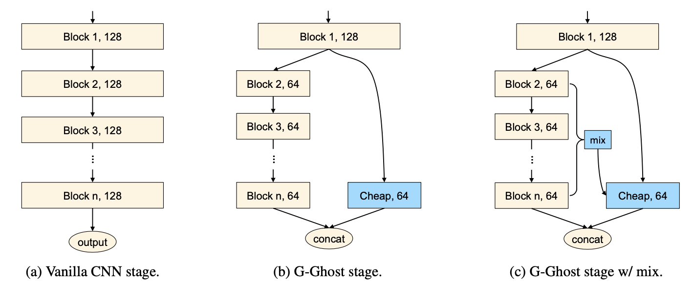

# G-GhostNet

GhostNets on Heterogeneous Devices via Cheap Operations. IJCV 2022. [[arXiv]](https://arxiv.org/abs/2201.03297)

By Kai Han, Yunhe Wang, Chang Xu, Jianyuan Guo, Chunjing Xu, Enhua Wu and Qi Tian.

- **Approach**

<div align="center">
   
</div>

## Requirements
The code was verified on Python3.6, PyTorch-1.3+.

## Code

We provide the code of G-Ghost RegNet in `g_ghost_regnet.py`.

Training and evaluation code follows the [official pytorch example](https://github.com/pytorch/examples/tree/main/imagenet)

## Pretrained models

The pretrained models are available at [Github Release](https://github.com/huawei-noah/Efficient-AI-Backbones/releases/tag/g_ghost_regnet).

| Model                            | Params | FLOPs | top-1 | usage                               |
| -------------------------------- | ------ | ----- | ----- | ----------------------------------- |
| g_ghost_regnet_3.2g_77.8.pth | 10.5M  | 1.8B  | 77.8  | `model = g_ghost_regnet.g_ghost_regnetx_032()` |
| g_ghost_regnet_4.0g_78.6.pth | 15.7M  | 2.2B  | 78.6  | `model = g_ghost_regnet.g_ghost_regnetx_040()` |
| g_ghost_regnet_8.0g_79.0.pth | 24.6M  | 4.2B  | 79.0  | `model = g_ghost_regnet.g_ghost_regnetx_080()` |
| g_ghost_regnet_16.0g_79.9.pth | 32.4M  | 9.0B  | 79.9  | `model = g_ghost_regnet.g_ghost_regnetx_160()` |


## Citation
```
@article{ghostnet2022,
  title={GhostNets on Heterogeneous Devices via Cheap Operations},
  author={Kai Han, Yunhe Wang, Chang Xu, Jianyuan Guo, Chunjing Xu, Enhua Wu and Qi Tian},
  journal={IJCV},
  year={2022}
}
```
