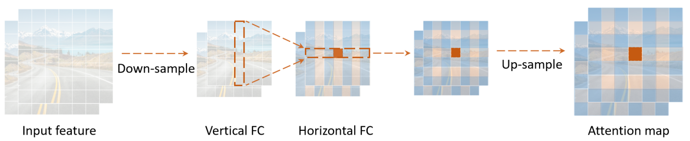
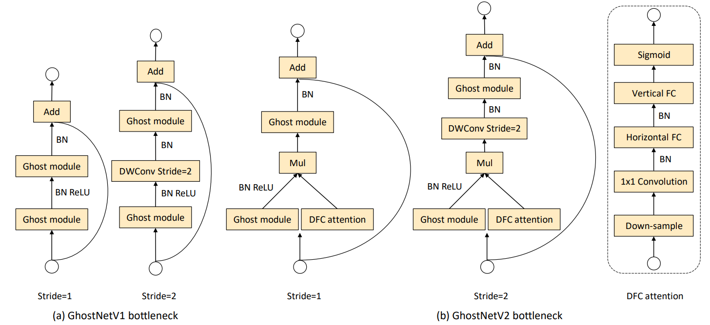
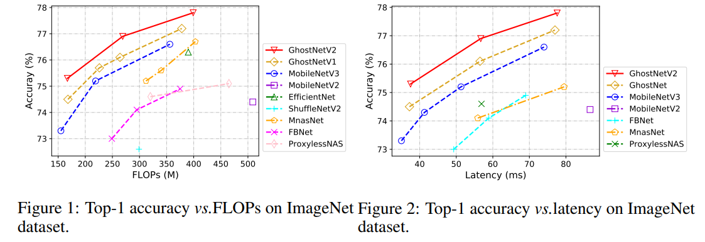

# GhostNetV2: Enhance Cheap Operation with Long-Range Attention

Code for our NeurIPS 2022 (Spotlight) paper, [GhostNetV2: Enhance Cheap Operation with Long-Range Attention](https://openreview.net/pdf/6db544c65bbd0fa7d7349508454a433c112470e2.pdf). Light-weight convolutional neural networks (CNNs) are specially designed for applications on mobile devices with faster inference speed. The convolutional operation can only capture local information in a window region, which prevents  performance from being further improved. Introducing self-attention into convolution can capture global information well, but it will largely encumber the actual speed. In this paper, we propose a hardware-friendly attention mechanism (dubbed DFC attention) and then present a new GhostNetV2 architecture for mobile applications. The proposed DFC attention is constructed based on fully-connected layers, which can not only execute fast on common hardware but also capture the dependence between long-range pixels. We further revisit the expressiveness bottleneck in previous GhostNet and propose to enhance expanded features produced by cheap operations with DFC attention, so that a GhostNetV2 block can aggregate local and long-range information simultaneously. Extensive experiments demonstrate the superiority of GhostNetV2 over existing architectures. For example, it achieves 75.3% top-1 accuracy on ImageNet with 167M FLOPs, significantly suppressing GhostNetV1 (74.5%) with a similar computational cost.

The information flow of DFC attention:

<p align="center">

</p>


The diagrams of blocks in GhostNetV1 and GhostNetV2:

<p align="center">

</p>


## Requirements

- python 3
- pytorch == 1.7.1
- torchvision == 0.8.2
- timm==0.3.2

## Usage


Run  ghostnetv2/train.py` to train models. For example,  you can run the following code to train GhostNetV2 on ImageNet dataset. 

```shell
python -m torch.distributed.launch --nproc_per_node=8 train.py path_to_imagenet/ --output /cache/models/ --model ghostnetv2 -b 128 --sched step --epochs 450 --decay-epochs 2.4 --decay-rate .973 --opt rmsproptf --opt-eps .001 -j 7 --warmup-lr 1e-6 --weight-decay 1e-5 --drop 0.2 --model-ema --model-ema-decay 0.9999 --aa rand-m9-mstd0.5 --remode pixel --reprob 0.2 --lr .064 --lr-noise 0.42 0.9 --width 1.0
```
## Results

<p align="center">

</p>