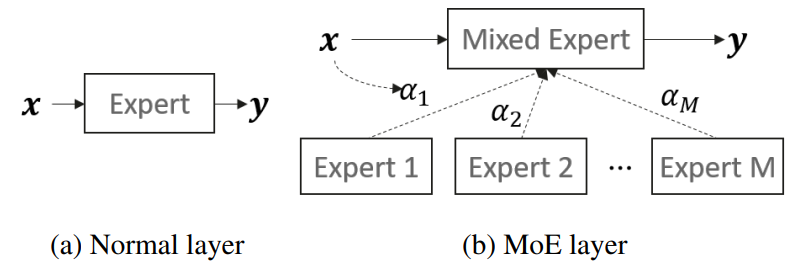
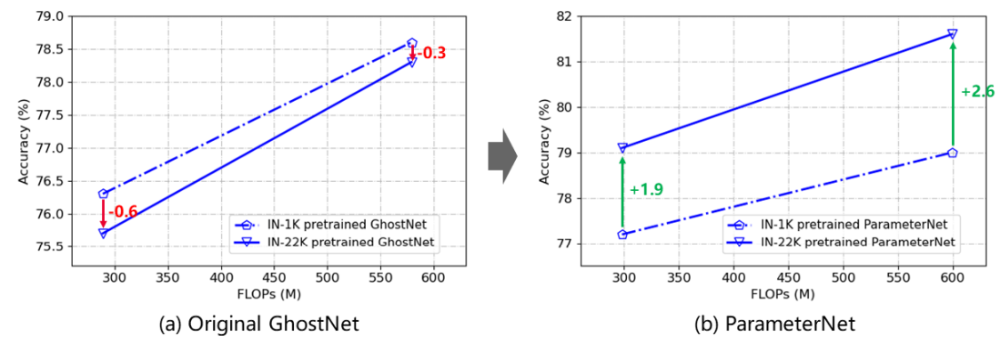

# ParameterNet: Parameters Are All You Need
Kai Han, Yunhe Wang, Jianyuan Guo, and Enhua Wu. [[arXiv link]](https://arxiv.org/pdf/2306.14525v2.pdf)

 !




## Citation
```
@article{han2023parameternet,
  title={ParameterNet: Parameters Are All You Need for Large-scale Visual Pretraining of Mobile Networks},
  author={Han, Kai and Wang, Yunhe and Guo, Jianyuan and Wu, Enhua},
  journal={arXiv preprint arXiv:2306.14525},
  year={2023}
}
```

## Acknowledgement
This repo partially uses code from [transformers](https://github.com/huggingface/transformers/tree/main).
