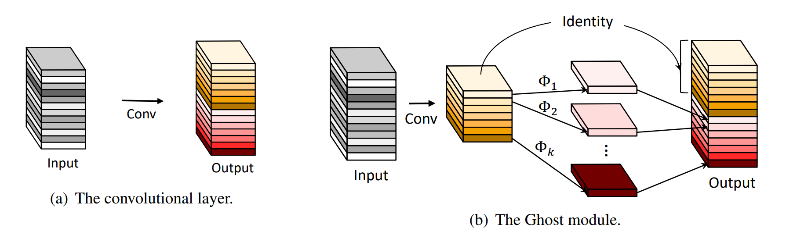
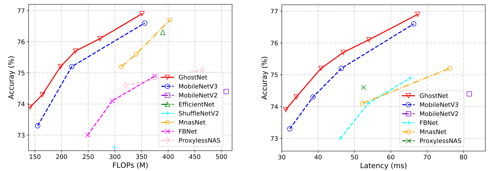

# GhostNet

**News** 

2020/11/10 The code of TinyNet (NeurIPS 2020) has been release at [MindSpore Model Zoo](https://gitee.com/mindspore/mindspore/tree/master/model_zoo/research/cv/tinynet).

2020/10/31 GhostNet+TinyNet achieves better performance. See details in our NeurIPS 2020 paper: [arXiv](https://arxiv.org/abs/2010.14819).

2020/09/24 We release GhostNet models for more vision tasks on [MindSpore Hub](https://www.mindspore.cn/resources/hub) and [MindSpore Model Zoo](https://gitee.com/mindspore/mindspore/tree/master/model_zoo/research/cv).

2020/06/10 GhostNet is included in [PyTorch Hub](https://pytorch.org/hub/pytorch_vision_ghostnet/).

2020/06/08 PyTorch code is included in this repo.

---

GhostNet: More Features from Cheap Operations. CVPR 2020. [[Paper]](http://openaccess.thecvf.com/content_CVPR_2020/html/Han_GhostNet_More_Features_From_Cheap_Operations_CVPR_2020_paper.html) [[arXiv]](https://arxiv.org/abs/1911.11907)

By Kai Han, Yunhe Wang, Qi Tian, Jianyuan Guo, Chunjing Xu, Chang Xu.

- **Approach**

<div align="center">
   
</div>

- **Performance**

GhostNet beats other SOTA lightweight CNNs such as **MobileNetV3** and **FBNet**.

<div align="center">
   
</div>

## Code

This repo provides TensorFlow code and PyTorch code:
- Tensorflow: [./tensorflow](https://github.com/huawei-noah/ghostnet/tree/master/tensorflow) with pretrained model.
- PyTorch: [./pytorch](https://github.com/huawei-noah/ghostnet/tree/master/pytorch) with pretrained model.
- We also opensource code on [MindSpore Hub](https://www.mindspore.cn/resources/hub) and [MindSpore Model Zoo](https://gitee.com/mindspore/mindspore/tree/master/model_zoo/research/cv).

## Citation
```
@inproceedings{ghostnet,
  title={GhostNet: More Features from Cheap Operations},
  author={Han, Kai and Wang, Yunhe and Tian, Qi and Guo, Jianyuan and Xu, Chunjing and Xu, Chang},
  booktitle={CVPR},
  year={2020}
}
@article{tinynet,
  title={Model Rubik’s Cube: Twisting Resolution, Depth and Width for TinyNets},
  author={Han, Kai and Wang, Yunhe and Zhang, Qiulin and Zhang, Wei and Xu, Chunjing and Zhang, Tong},
  journal={Advances in Neural Information Processing Systems},
  volume={33},
  year={2020}
}
```

## Other versions
This repo provides the TensorFlow/PyTorch code of GhostNet. Other versions can be found in the following:

1. Darknet: [cfg file](https://github.com/AlexeyAB/darknet/files/3997987/ghostnet.cfg.txt), and [description](https://github.com/AlexeyAB/darknet/issues/4418)
2. Gluon/Keras/Chainer: [code](https://github.com/osmr/imgclsmob)
3. Paddle: [code](https://github.com/PaddlePaddle/PaddleClas/blob/master/ppcls/modeling/architectures/ghostnet.py)
4. Pytorch for human pose estimation: [code](https://github.com/tensorboy/centerpose/blob/master/lib/models/backbones/ghost_net.py)
5. YOLO with GhostNet backbone: [cdoe](https://github.com/HaloTrouvaille/YOLO-Multi-Backbones-Attention)
