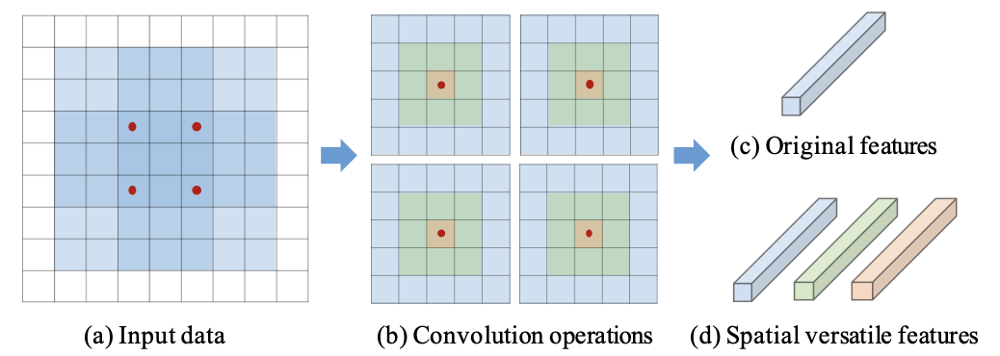
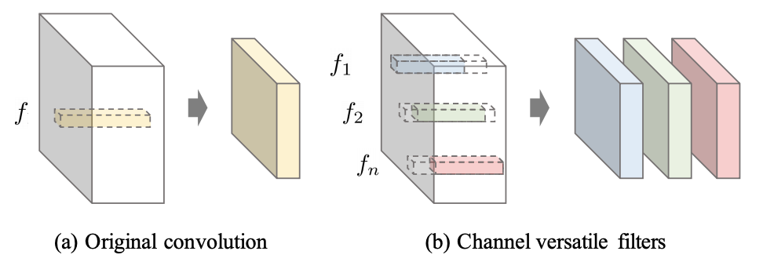

## Versatile Filters

Code for paper: [Yunhe Wang, et al. Learning Versatile Filters for Efficient Convolutional Neural Networks (NeurIPS 2018)](https://papers.nips.cc/paper/7433-learning-versatile-filters-for-efficient-convolutional-neural-networks)

This paper introduces versatile filters to construct efficient convolutional neural network. A series of secondary filters can be derived from a primary filter. These secondary filters all inherit in the primary filter without occupying more storage, but once been unfolded in computation they could significantly enhance the capability of the filter by integrating information extracted from different receptive fields. Besides spatial versatile filters, we additionally investigate versatile filters from the channel perspective. The new techniques are general to upgrade filters in existing CNNs, which are able to achieve comparable accuracy as that of original filters, but require less memory and FLOPs.




### Files description
Platform: Pytorch 0.4

`vcnn.py` is the implementation of Versatile Convolution (an example of VGG-16). The `VConv2d` class can be used to replace the `nn.Conv2d` in any CNN.

`imagenet-vcnn.py` is the script for training ImageNet on Huawei Cloud DLS.

### Getting Started
Run `imagenet-vcnn.py` to train and test the model.

- **Hyper-paprameters** in `VConv2d`:
- `delta`: (c-\hat{c}) in Eq.(6)
- `g`: g in Eq.(6)

### Performance
- ImageNet Classification (code in this repo)

| backbone | method                    | top1 acc (%) | top5 acc (%) |
|--------|---------------------------|----------|----------|
| VGG-16 | spatial versatile filters        | 72.2     | 91.1     |

- COCO Object Detection using Faster R-CNN

|Backbone|Memory (MB)|FLOPs (B)|mAP (%)|
|-|-|-|-|
|ResNet50|97.2|4.1|33.1|
|Versatile-v1-ResNet50|75.6|3.2|33.0|
|Versatile-v2-ResNet50|41.7|3.0|31.3|

### Citation
If you use these models in your research, please cite:
```
@inproceedings{wang2018learning,
  title={Learning versatile filters for efficient convolutional neural networks},
  author={Wang, Yunhe and Xu, Chang and Chunjing, XU and Xu, Chao and Tao, Dacheng},
  booktitle={Advances in Neural Information Processing Systems},
  pages={1608--1618},
  year={2018}
}
```

### Contributing
We appreciate all contributions. If you are planning to contribute back bug-fixes, please do so without any further discussion.

If you plan to contribute new features, utility functions or extensions to the core, please first open an issue and discuss the feature with us. Sending a PR without discussion might end up resulting in a rejected PR, because we might be taking the core in a different direction than you might be aware of.
