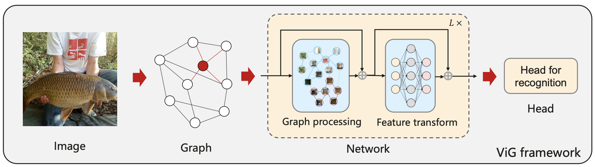

# Vision GNN
By Kai Han, Yunhe Wang, Jianyuan Guo, Yehui Tang and Enhua Wu. [[arXiv link]](https://arxiv.org/abs/2206.00272)



## Requirements
Pytorch 1.7.0,
timm 0.3.2,
torchprofile 0.0.4,
apex

## ViG Code
Paper: [Vision GNN: An Image is Worth Graph of Nodes](https://arxiv.org/abs/2206.00272)

- Training example for 8 GPUs:
```
python -m torch.distributed.launch --nproc_per_node=8 train.py /path/to/imagenet/ --model pvig_s_224_gelu --sched cosine --epochs 300 --opt adamw -j 8 --warmup-lr 1e-6 --mixup .8 --cutmix 1.0 --model-ema --model-ema-decay 0.99996 --aa rand-m9-mstd0.5-inc1 --color-jitter 0.4 --warmup-epochs 20 --opt-eps 1e-8 --repeated-aug --remode pixel --reprob 0.25 --amp --lr 2e-3 --weight-decay .05 --drop 0 --drop-path .1 -b 128 --output /path/to/save/models/
```

- Pretrained models

|Model|Params (M)|FLOPs (B)|Top-1|URL|
|-|-|-|-|-|
|Pyramid ViG-Ti|10.7|1.7|78.5|[[BaiduDisk]](https://pan.baidu.com/s/1Vrr-oXQeUFujaHKMC5sXIQ), Password: chae|
|Pyramid ViG-S|27.3|4.6|82.1|[[BaiduDisk]](https://pan.baidu.com/s/10MWZznvPIvGAiBtnwj7TRg), Password: 81mg|
|Pyramid ViG-M|51.7|8.9|83.1|[[BaiduDisk]](https://pan.baidu.com/s/1N3nviACOrY0XBC0FKoDL6g), Password: prd3|
|Pyramid ViG-B|82.6|16.8|83.7|[[BaiduDisk]](https://pan.baidu.com/s/1b5OvPZXwcSwur2nuDAzf5Q), Password: rgm4|

- Evaluate example:
```
python train.py /path/to/imagenet/ --model pvig_s_224_gelu -b 256 --pretrain_path /path/to/pretrained/model/ --evaluate
```

## Citation
```
@misc{vig,
  title={Vision GNN: An Image is Worth Graph of Nodes}, 
  author={Kai Han and Yunhe Wang and Jianyuan Guo and Yehui Tang and Enhua Wu},
  year={2022},
  eprint={2206.00272},
  archivePrefix={arXiv}
}
```

## Acknowledgement
This repo partially uses code from [deep_gcns_torch](https://github.com/lightaime/deep_gcns_torch) and [timm](https://github.com/rwightman/pytorch-image-models).
