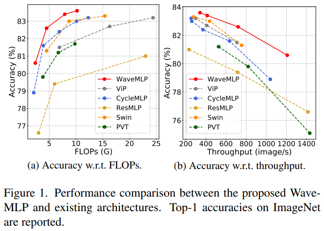
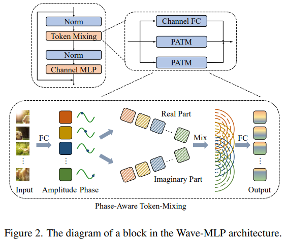

# Wave-MLP


##  Official implementation for our CVPR 2022 paper, [An Image Patch is a Wave: Quantum Inspired Vision MLP](https://arxiv.org/pdf/2111.12294.pdf)

In the field of computer vision, recent works show that a pure MLP architecture mainly stacked by fully-connected layers can achieve competing performance with CNN and transformer. An input image of vision MLP is usually split into multiple tokens (patches), while the existing MLP models directly aggregate them with fixed weights, neglecting the varying semantic information of tokens from different images. To dynamically aggregate tokens, we propose to represent each token as a wave function with two parts, amplitude and phase. Amplitude is the original feature and the phase term is a complex value changing according to the semantic contents of input images. Introducing the phase term can dynamically modulate the relationship between tokens and fixed weights in MLP. Based on the wave-like token representation, we establish a novel Wave-MLP architecture for vision tasks. 

<p align="center">

</p>
<p align="center">

</p>


## Results


### Wave-MLP trained on ImageNet-1K

| Model       | Parameters | FLOPs | Top 1 Acc. |                             Log                              |                          Checkpoint                          |
| :---------- | :--------: | :---: | :--------: | :----------------------------------------------------------: | :----------------------------------------------------------: |
| Wave-MLP-T* |    15M     | 2.1G  |   80.1%    | [github](https://github.com/huawei-noah/CV-Backbones/releases/download/wavemlp/WaveMLP_T_dw.log) | [github](https://github.com/huawei-noah/CV-Backbones/releases/download/wavemlp/WaveMLP_T_dw.pth.tar) |
| Wave-MLP-T  |    17M     | 2.4G  |   80.9%    | [github](https://github.com/huawei-noah/CV-Backbones/releases/download/wavemlp/WaveMLP_T.log) | [github](https://github.com/huawei-noah/CV-Backbones/releases/download/wavemlp/WaveMLP_T.pth.tar) |
| Wave-MLP-S  |    30M     | 4.5G  |   82.9%    | [github](https://github.com/huawei-noah/CV-Backbones/releases/download/wavemlp/WaveMLP_S.log) | [github](https://github.com/huawei-noah/CV-Backbones/releases/download/wavemlp/WaveMLP_S.pth.tar) |
| Wave-MLP-M  |    44M     | 7.9G  |   83.3%    | [github](https://github.com/huawei-noah/CV-Backbones/releases/download/wavemlp/WaveMLP_M.log) | [github](https://github.com/huawei-noah/CV-Backbones/releases/download/wavemlp/WaveMLP_M.pth.tar) |

## Usage


### Install

```
pip install torch==1.7.1 torchvision==0.8.2
pip install timm==0.3.2
pip install thop
pip install -v --disable-pip-version-check --no-cache-dir --global-option="--cpp_ext" --global-option="--cuda_ext" ./apex-master/
```


### Training

#### Training Wave-MLP

On a single node with 8 gpus, you can train the Wave-MLP family on ImageNet-1K as follows :

WaveMLP_T*:
```shell
python -m torch.distributed.launch --nproc_per_node 8 --nnodes=1 --node_rank=0 train.py /your_path_to/imagenet/ --output /your_path_to/output/  --model WaveMLP_T_dw --sched cosine --epochs 300 --opt adamw -j 8 --warmup-lr 1e-6 --mixup .8 --cutmix 1.0 --model-ema --model-ema-decay 0.99996 --aa rand-m9-mstd0.5-inc1 --color-jitter 0.4 --warmup-epochs 5 --opt-eps 1e-8 --repeated-aug --remode pixel --reprob 0.25 --amp --lr 1e-3 --weight-decay .05 --drop 0 --drop-path 0.1 -b 128
```
WaveMLP_T:

```shell
python -m torch.distributed.launch --nproc_per_node 8 --nnodes=1 --node_rank=0 train.py /your_path_to/imagenet/ --output /your_path_to/output/  --model WaveMLP_T --sched cosine --epochs 300 --opt adamw -j 8 --warmup-lr 1e-6 --mixup .8 --cutmix 1.0 --model-ema --model-ema-decay 0.99996 --aa rand-m9-mstd0.5-inc1 --color-jitter 0.4 --warmup-epochs 5 --opt-eps 1e-8 --repeated-aug --remode pixel --reprob 0.25 --amp --lr 1e-3 --weight-decay .05 --drop 0 --drop-path 0.1 -b 128
```

WaveMLP_S:

```shell
python -m torch.distributed.launch --nproc_per_node 8 --nnodes=1 --node_rank=0 train.py /your_path_to/imagenet/ --output /your_path_to/output/ --model WaveMLP_S --sched cosine --epochs 300 --opt adamw -j 8 --warmup-lr 1e-6 --mixup .8 --cutmix 1.0 --model-ema --model-ema-decay 0.99996 --aa rand-m9-mstd0.5-inc1 --color-jitter 0.4 --warmup-epochs 5 --opt-eps 1e-8 --repeated-aug --remode pixel --reprob 0.25 --amp --lr 1e-3 --weight-decay .05 --drop 0 --drop-path 0.1 -b 128
```

WaveMLP_M:

```shell
python -m torch.distributed.launch --nproc_per_node 8 --nnodes=1 --node_rank=0 train.py /your_path_to/imagenet/ --output /your_path_to/output/  --model WaveMLP_M --sched cosine --epochs 300 --opt adamw -j 8 --warmup-lr 1e-6 --mixup .8 --cutmix 1.0 --model-ema --model-ema-decay 0.99996 --aa rand-m9-mstd0.5-inc1 --color-jitter 0.4 --warmup-epochs 5 --opt-eps 1e-8 --repeated-aug --remode pixel --reprob 0.25 --amp --lr 1e-3 --weight-decay .05 --drop 0 --drop-path 0.1 -b 128
```


## Citation

```bibtex
@article{tang2021image,
  title={An image patch is a wave: Phase-aware vision mlp},
  author={Tang, Yehui and Han, Kai and Guo, Jianyuan and Xu, Chang and Li, Yanxi and Xu, Chao and Wang, Yunhe},
  journal={arXiv preprint arXiv:2111.12294},
  year={2021}
}
```

